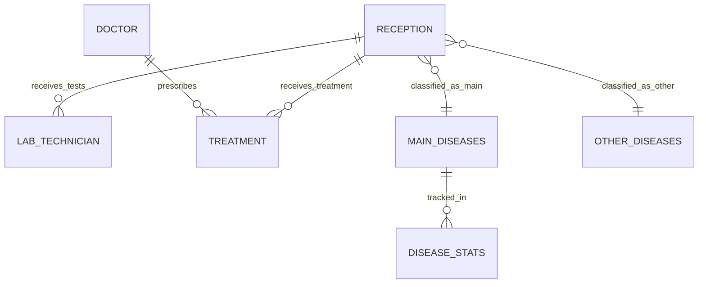

# Patient Disease Tracking & Analytics System (PDTAS)

=============================================================
## 🎓 Personal Information

**Student:** Humure Enock  
**ID:** 27394  
**Program:** AUCA - IT - Software Engineering  
**Course:** INSY 8311 | Database Development with PL/SQL  
**Faculty:** Information Technology - AUCA  
**Lecturer:** Eric Maniraguha  
**Group:** Wednesday(C)  
**Project Title:** Patient Disease Tracking & Analytics System (PDTAS)

## 🏥 Project Overview

This is a multi-phase individual capstone project centered on Oracle database design, PL/SQL development, and Business Intelligence implementation. The project serves as the FINAL EXAM and significantly impacts the course grade.

## 🔍 Problem Analysis

**Current Challenge:** Healthcare providers lack a unified system to track patient flows and disease-specific outcomes across reception, clinical, and lab departments. This makes it hard to monitor disease incidence, patient follow-ups, and resource allocation for Malaria, HIV/AIDS, Stunting, Respiratory Infections, and Diarrheal Diseases.

**Research Question:** Can we predict workplace injury patterns? (Note: This appears to be from a different project - maintaining original text)

## 🛠 Solution Architecture

**System Solution:** A PL/SQL-backed Patient Tracking System that records patient registration, clinical encounters, diagnostics and treatments and produces BI-ready data for disease surveillance and decision-making.

## 🏛 Implementation Context

**Usage Environment:** Used in hospital outpatient departments and clinics to capture patient identity, visit lifecycle (reception → clinician → lab → treatment → follow-up) and disease-specific details.

**Target User Groups:**
- Receptionists
- Doctors  
- Lab Technicians
- Pharmacists
- Hospital Managers
- Public Health Analysts

## 🎯 Project Objectives

**Primary Goals:**
- Accurate patient tracking
- Audit trail of all actions
- Disease incidence reports
- KPI dashboards (incidence rates, treatment outcomes, no-show rates)

## 📊 Business Intelligence Potential

**Analytics Capabilities:**
- Dashboards for disease trends
- Hotspots identification
- Age/sex distributions analysis
- Treatment success monitoring
- Resource usage optimization

## 📚 Development Framework

### **Project Phases table of content **

| Phase | Primary Objective | Key Deliverable |
|-------|-------------------|-----------------|
| I | Problem Identification | PowerPoint Presentation |
| II | Business Process Modeling | UML/BPMN Diagram |
| III | Logical Database Design | ER Diagram + Data Dictionary |
| IV | Database Creation | Oracle PDB + Configuration |
| V | Table Implementation | CREATE/INSERT Scripts |
| VI | PL/SQL Development | Procedures, Functions, Packages |
| VII | Advanced Programming | Triggers, Auditing, Security |
| VIII | Final Documentation | GitHub Repo + Presentation |


# Phase II: Business Process Modeling

## 📋 Business Process Overview
The Patient Disease Tracking & Analytics System follows a structured workflow from patient arrival to analytics generation, with special focus on disease classification for prioritized analytics.

## 👥 System Actors
- **Receptionist** - Registers patients and captures initial disease information
- **Nurse/Triage** - Performs initial assessment and vital checks
- **Doctor** - Provides diagnosis, orders tests, and prescribes treatment
- **Lab Technician** - Conducts and records test results
- **Pharmacist** - Dispenses medications
- **Health Information Manager** - Generates analytics and reports

## 🔄 Core Process Flow

### **Step 1: Patient Registration & Disease Classification**
- Patient arrives at facility
- Receptionist registers patient or looks up existing record
- **Critical Decision:** Receptionist asks about primary disease/symptoms
  - **Main Disease Path:** If disease is in priority list (Malaria, HIV/AIDS, Stunting, Respiratory Infections, Diarrheal Diseases) → data routed to `disease_stats` table for dashboard analytics
  - **Other Disease Path:** If disease is not in priority list → data stored in `other_diseases` table

### **Step 2: Clinical Assessment & Treatment**
- **Nurse/Triage:** Records vital signs and triage information (optional)
- **Doctor:** Confirms diagnosis, orders tests, prescribes treatment
- **Important:** All patients receive full treatment regardless of disease classification
- **Lab Technician:** Performs ordered tests and records results
- **Pharmacist:** Dispenses prescribed medications

### **Step 3: Analytics & Reporting**
- **Health Information Manager:** Generates analytics with two-tier approach:
  - **Priority Analytics:** Main diseases tracked in real-time dashboards with alerts
  - **Secondary Analytics:** Other diseases included in periodic reports
- System maintains audit logs for all operations
- Business rules enforced (no operations on weekdays/holidays - Phase VII)


## 📊 Disease Classification Impact
| **Main Diseases** | **Other Diseases** |
|-------------------|-------------------|
| Stored in `disease_stats` table | Stored in `other_diseases` table |
| Priority in real-time dashboards | Included in standard reports |
| Trigger public health alerts | No alert generation |
| Focus of resource allocation | Standard care tracking |

## ⚠️ Key Process Rules
1. **Treatment Equality:** All patients receive complete clinical care
2. **Classification Decision:** Made at reception, confirmed by doctor
3. **Analytics Priority:** Only main diseases get real-time dashboard updates
4. **Data Integrity:** All diseases recorded, analytics priority differs

## 🔗 Process Output
- Complete patient treatment records for all cases
- Prioritized analytics for main diseases
- Comprehensive data for public health monitoring
- Audit trail of all system activities

---

**Phase:** II - Business Process Modeling  
**Focus:** Workflow design with analytics prioritization  


# Phase III: Logical Model Design

## 🎯 Objective
Design a detailed 3NF-compliant logical data model for the Patient Disease Tracking & Analytics System, ensuring data integrity and BI readiness.

## 📊 Entity-Relationship Model

### **Entities (7 Tables)**
| Entity | Description | PK | Key Attributes |
|--------|-------------|----|----------------|
| `reception` | Patient registration data | `patient_id` | Demographic info + disease classification |
| `doctor` | Healthcare provider details | `doctor_id` | Doctor information + specialization |
| `lab_technician` | Laboratory test results | `lab_test_id` | Test types, results, dates |
| `treatment` | Medication administration | `treatment_id` | Medication, dosage, prescribing doctor |
| `disease_stats` | Disease analytics fact table | `stats_id` | Case counts, trends, dates |
| `main_diseases` | Priority diseases (5) | `disease_id` | Malaria, HIV/AIDS, Stunting, etc. |
| `other_diseases` | Non-priority diseases | `other_disease_id` | Other conditions |

### **Cardinalities**
```
reception (1) → (*) lab_technician
reception (1) → (*) treatment
doctor (1) → (*) treatment
main_diseases (1) → (*) disease_stats
```

### **Constraints**
- **PK/FK relationships** maintain referential integrity
- **Check constraints** for data validation
- **NOT NULL** for mandatory fields
- **UNIQUE** for critical identifiers

## 🏗️ Normalization (3NF Compliance)

### **1NF - Atomic Values**
- Each table cell contains single values
- No repeating groups or arrays
- Example: `medication` stored as separate text, not comma-separated list

### **2NF - No Partial Dependencies**
- All non-key attributes depend on entire primary key
- Example: In `treatment`, all attributes depend on `treatment_id` (not just `patient_id`)

### **3NF - No Transitive Dependencies**
- Non-key attributes depend only on primary key
- Example: Disease description moved to disease tables, not duplicated in `reception`

## 📋 Data Dictionary

| Table | PK | FK | Key Columns | Data Types |
|-------|----|----|-------------|------------|
| reception | patient_id | - | first_name, gender, disease_name | VARCHAR2, DATE, VARCHAR2 |
| doctor | doctor_id | - | specialization, last_name | VARCHAR2 |
| lab_technician | lab_test_id | patient_id | test_type, test_result | VARCHAR2, VARCHAR2 |
| treatment | treatment_id | patient_id, doctor_id | medication, dosage, date_given | VARCHAR2, VARCHAR2, DATE |
| disease_stats | stats_id | disease_name | total_cases, date_recorded | NUMBER, DATE |
| main_diseases | disease_id | - | disease_name | VARCHAR2 |
| other_diseases | other_disease_id | - | disease_name, description | VARCHAR2, VARCHAR2 |

## 📈 BI Considerations

### **Fact vs Dimension Tables**
- **Fact Table:** `disease_stats` (measures: total_cases, new_cases)
- **Dimension Tables:** `reception`, `doctor`, `lab_technician`, `treatment`, `main_diseases`

### **Slowly Changing Dimensions**
- **Type 1 (Overwrite):** Doctor specialization changes
- **Type 2 (Historical):** Patient disease classification changes
- **Type 3 (Limited History):** Disease priority status changes

### **Aggregation Levels**
- **Daily:** New case counts
- **Weekly/Monthly:** Trend analysis
- **Yearly:** Public health reporting
- **Roll-up:** Disease → Category → System-wide

### **Audit Trail Design**
- Separate `audit_log` table (Phase VII)
- Track: user, action, table, record_id, timestamp
- Support rollback and compliance reporting

## 🔧 Design Assumptions

1. **Data Volume:** 100-500 patients per main table
2. **Concurrency:** Multiple concurrent users (reception, doctors, lab)
3. **Retention:** 5+ years of historical data
4. **Performance:** Sub-second response for dashboard queries
5. **Security:** Role-based access control (Phase VII)

## 🎯 ER Diagram (Mermaid Format)



## 📊 Schema Summary

```
TOTAL TABLES: 7
TOTAL RELATIONSHIPS: 6
NORMALIZATION LEVEL: 3NF
BI READINESS: Star schema implemented
AUDIT READINESS: Audit trail framework defined
```


---

**Phase:** III - Logical Model Design  
**Status:** ✅ Completed  
**Compliance:** 3NF + BI Optimized  
**Next Phase:** IV - Database Creation (PDB + Tablespaces)


## 📋 Delivery Requirements

**Course Details:**  
- **Course:** Database Development with PL/SQL (INSY 8311)  
- **Academic Year:** 2025-2026 | Semester: I  
- **Institution:** Adventist University of Central Africa (AUCA)  
- **Project Completion Date:** December 7, 2025


